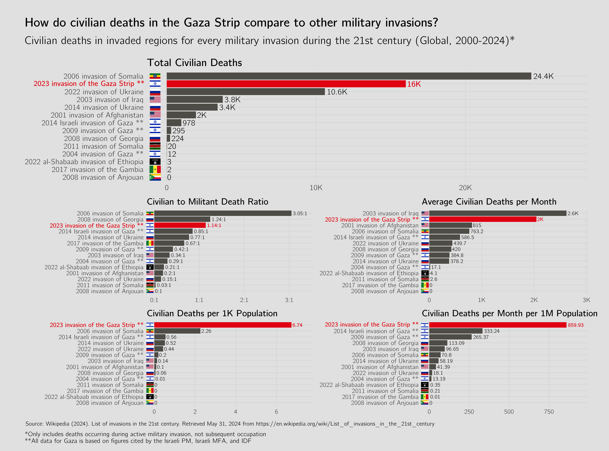
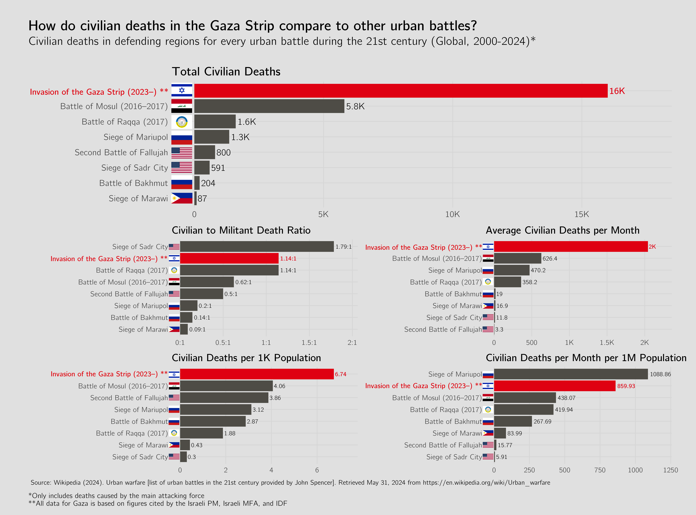

# Gaza Civilian Deaths

It is often claimed that the rates of civilian casualties in the current Gaza invasion are comparable to similar invasions in recent history. I tested this claim by taking data from the complete list of 21st century invasions on Wikipedia and comparing civilian deaths for each conflict, using a variety of different metrics. (The Wikipedia list was used to avoid potential bias and cherry-picking as to which conflicts should be included in the analysis).

I used the most cited civilian death figures for each conflict provided on their respective Wikipedia page (again, to avoid any potential bias I might inject if I were to pick the sources myself). I also used the civilian death estimates provided by Israel for all of the Gaza data, to avoid any accusations of using data provided by a potentially unreliable source like the Gaza Ministry of Health. 

Even using Israeli figures, it appears that the 2023 invasion of the Gaza Strip has some of the highest rates of civilian casualties, by multiple different metrics. 

I also performed the same analysis using only urban battles, since one could make the case that invasions of entire countries are not an appropriate comparison to the invasion of the Gaza Strip, which involves dense civilian populations that are more likely to produce civilian casualties. Again, I used a list of 21st century urban battles curated by John Spencer and cited on the Wikipedia page for urban warfare. This, again, ensures that I had no ability to cherry-pick conflicts to suit a particular narrative. Again, I only used civilian death estimates provided by Israel for the Gaza Strip data. All other civilian death figures came from the most cited civilian death figures for each conflict on their respective Wikipedia pages.

It seems clear that the 2023 Gaza Strip invasion has abnormally high civilian casualties for urban combat too – by multiple metrics, using Israeli figures.
